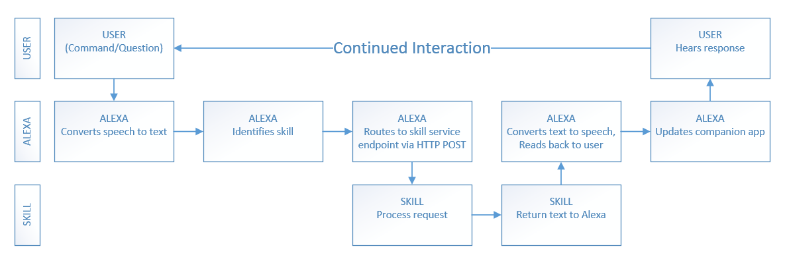

# Sharpen your Alexa skills

## Alexa and Echo

## Before you begin

Register for a developer account
-	go to developer.amazon.com and register for a free developer account
-	(optional) create aws.amazon.com account
Alexa Skills Kit (ASK)
Alexa Voice Service

## Types of Alexa skills

### Custom skills
- Custom skills consume a web service that can be hosted anywhere and can be developed in any language.

### Smart Home skills
- Turn on/off the lights, set thermostat, control entertainment devices, etc.
- All interactions are handled by the Smart Home Skill API.

### Video skills
- All interactions are handled by the Video Skill API.

### Flash briefing skills
- Provide content such as news for the user’s flash briefing. 
- RSS or JSON feed.

## Create Alexa skill

1.	Provide skill name
2.	Select skill type
3.	Add skill invocation name
- Two or more lower case words
- Cannot be a lunch phrase (launch, ask, tell, load, begin, enable)
- Cannot be a wake word (Alexa, Echo, Amazon, Computer)
- Does not need to be unique
4.	Add custom intent
5.	Add sample utterances

## Testing your Alexa skill

## Deploying Alexa skill

## Links

[developer.amazon.com](http://developer.amazon.com)

[AWS SDK for .NET](https://aws.amazon.com/sdk-for-net/)

[Alexa Skills SDK for .NET](https://github.com/timheuer/alexa-skills-dotnet)