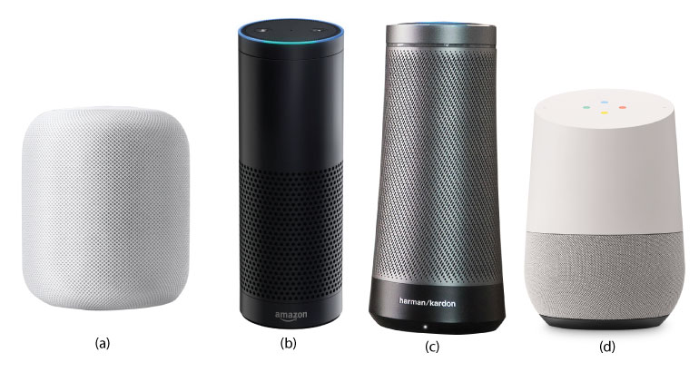
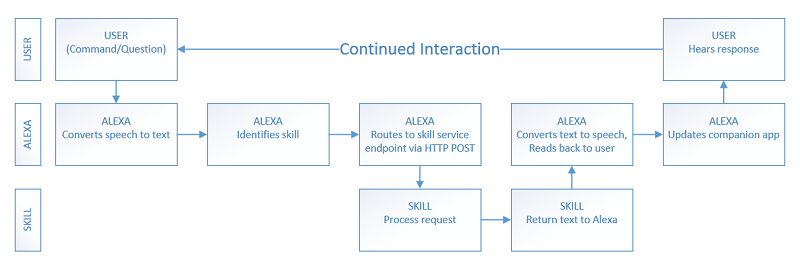
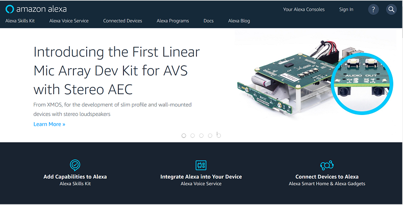

## Sharpen your Alexa skills

### Zdravko Danev

#### Sr. Developer @ AgileThought

#### E-mail: [zdanev@gmail.com](mailto:zdanev@gmail.com)

#### Twitter: [@zdanev](http://twitter.com/zdanev)

#### Code and Slides: http://github.com/zdanev/occ2018

---

### The state of AI, NLP, etc.



---

### Dartmouth Workshop

> "We propose that a 2 month, 10 man study of artificial intelligence be carried out during the summer of 1956 at Dartmouth College in Hanover, New Hampshire. The study is to proceed on the basis of the conjecture that every aspect of learning or any other feature of intelligence can in principle be so precisely described that a machine can be made to simulate it. An attempt will be made to find how to make machines use language, form abstractions and concepts, solve kinds of problems now reserved for humans, and improve themselves. We think that a significant advance can be made in one or more of these problems if a carefully selected group of scientists work on it together for a summer."

-- John McCarthy, 1955

---

### "Time flies like an arrow"

#### "Fruit flies like a bannana"

> "A grammar that pretends to describe English at all accurately must yield a structure for “Time flies like an arrow” in which “time” is the subject of the verb “flies” and “like an arrow” is an adverbial phrase modifying the verb. “Time” can also serve attributively, however, as in “time bomb,” and “flies” of course can serve as a noun. Together with “like” interpreted as a verb, this yields a structure that becomes obvious only if one thinks of a kind of flies called “time flies,” which happen to like an arrow, perhaps as a meal. Moreover, “time” as an imperative verb with “flies” as a noun also yields a structure that makes sense as an order to someone to take out his stopwatch and time flies with great dispatch, or like an arrow."

-- Anthony Oettinger, 1966

---

### Alexa and Echo


- Echo is a hardware device ("smart speaker") device from Amazon
- Alexa is the voice personality behind the Echo devices

---

### Before you begin

#### Register for a developer account(s)

- go to [developer.amazon.com](http://developer.amazon.com) and register for a free developer account
- (optional) create [aws.amazon.com](http://aws.amazon.com) account

#### Download tools and SDKs

- download Alexa Skills Kit
- download AWS SDK for .net tools
- download AWS CLI tools [aws.amazon.com/cli](http://aws.amazon.com/cli)

---

### User Interaction Flow



image is from article in *CODE Magazine*

---

### Structure of a Command

#### Wake Word + Phrase + Invocation Name + Intent (+ optional limit)

Wake word: Alexa, Echo, Computer, Amazon

Command: Ask, Tell, Play, Turn on/off, Begin, Launch, Open, Resume, Start, Talk to, Use

Prepositions: About, For, If, To

#### Examples

Alexa, TURN OFF the lights

Alexa, PLAY artist Metallica

Alexa, ASK SurfReport ABOUT high-tide tomorrow

---

### Alexa Developer Portal

[http://developer.amazon.com/alexa](http://developer.amazon.com/alexa)



---

### Alexa Voice Service (AVS)

[http://developer.amazon.com/alexa-voice-service](http://developer.amazon.com/alexa-voice-service)

- cloud based voice-recognition and NLP service that powers Amazon Alexa and Echo devices
- can be used to voice-enable virtually any device (i.e. Raspberi Pi) for building home automation or other voice-enabled solution

---

### Alexa Skills Kit (ASK)

[http://developer.amazon.com/alexa-skills-kit](http://developer.amazon.com/alexa-skills-kit)

- Alexa Skills SDK
- Documentation
- Samples

---

### Types of Alexa skills

#### Custom skills

- Custom skills consume a web service that can be hosted anywhere and can be developed in any language.

#### Smart Home skills

- Turn on/off the lights, set thermostat, control entertainment devices, etc.
- All interactions are handled by the Smart Home Skill API.

#### Video skills

- All interactions are handled by the Video Skill API.

#### Flash briefing skills

- Provide content such as news for the user’s flash briefing. 
- RSS or JSON feed.

---

### Intents

- Build-in intents
    - AMAZON.HelpIntent
    - AMAZON.StopIntent
    - AMAZON.CancelIntent
    - AMAZON.YesIntent
    - AMAZON.NoIntent
- Custom intents
- Slots

---

### speechAssets/SampleUtterances.txt

```
RecipeIntent how can I build {Item}
RecipeIntent how can I build a {Item}
RecipeIntent how can I build an {Item}
```

---

### speechAssets/IntentSchema.json

```
    {
        "intents": 
        [
            {
                "intent": "RecipeIntent",
                "slots": 
                [
                    {
                        "name": "Item",
                        "type": "LIST_OF_ITEMS"
                    }
                ]
            },
            {
                "intent": "AMAZON.HelpIntent"
            },
            {
                "intent": "AMAZON.StopIntent"
            },
            {
                "intent": "AMAZON.CancelIntent"
            }
        ]
    }
```

---

### Create AWS Lambda function with .net core

[https://docs.aws.amazon.com/lambda/latest/dg/lambda-dotnet-coreclr-deployment-package.html](https://docs.aws.amazon.com/lambda/latest/dg/lambda-dotnet-coreclr-deployment-package.html)

```
aws configure
dotnet new -i Amazon.Lambda.Templates::*
md HelloLambda
cd HelloLambda
dotnet new lambda.EmptyFunction
dotnet lambda deploy-function
```

---

### Create Alexa skill

[http://developer.amazon.com/alexa/console/ask](http://developer.amazon.com/alexa/console/ask)

1. Provide skill name (i.e. CodeCampSkill)
2. Select skill type (i.e. Custom)
3. Add skill invocation name
    - Two or more lower case words
    - Cannot be a lunch phrase (Launch, Ask, Tell, Load, Begin, Enable)
    - Cannot be a wake word (Alexa, Echo, Amazon, Computer)
    - Does not need to be unique
4. Add custom intent
5. Add sample utterances

---

### Testing your Alexa skill

#### Testing with simulator

[http://echosim.io](https://echosim.io)

#### Testing with device

- login to Alexa Developer Console, and enable the "Test" switch on your skill from the "Test" Tab

---

### Deploying Alexa skill

---

### Links

#### Amazon Developer Portal

[http://developer.amazon.com](http://developer.amazon.com)

#### Alexa Developer Portal

[http://developer.amazon.com/alexa](http://developer.amazon.com/alexa)

#### AWS SDK for .NET

[http://aws.amazon.com/sdk-for-net/](http://aws.amazon.com/sdk-for-net/)

#### Alexa Skills SDK for .NET (Tim Heuer)

[http://github.com/timheuer/alexa-skills-dotnet](http://github.com/timheuer/alexa-skills-dotnet)

#### Alexa Skills Samples

[http://github.com/alexa](http://github.com/alexa)

---

### More Links

#### Alexa Fund

[http://developer.amazon.com/alexa-fund](http://developer.amazon.com/alexa-fund)

#### Alexa Prize

[http://developer.amazon.com/alexaprize](http://developer.amazon.com/alexaprize)

#### Hackster.io

[http://www.hackster.io](http://www.hackster.io)

---

### Keep in touch

#### Zdravko Danev

#### E-mail: [zdanev@gmail.com](mailto:zdanev@gmail.com)

#### Twitter: [@zdanev](http://twitter.com/zdanev)

#### Code and Slides: http://github.com/zdanev/occ2018
