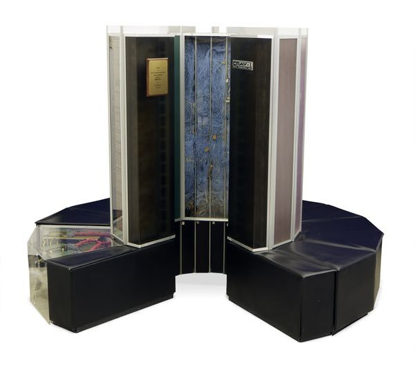
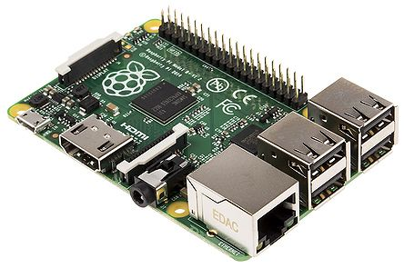

## Sharpen your Alexa skills

### Zdravko Danev

#### Sr. Developer @ AgileThought

#### E-mail: [zdanev@gmail.com](mailto:zdanev@gmail.com)

#### Twitter: [@zdanev](http://twitter.com/zdanev)

#### Code and Slides: http://github.com/zdanev/occ2018

---

### The state of AI, NLP, etc.


---

### The birth of AI

#### Dartmouth Workshop

> "We propose that a 2 month, 10 man study of artificial intelligence be carried out during the summer of 1956 at Dartmouth College in Hanover, New Hampshire. The study is to proceed on the basis of the conjecture that every aspect of learning or any other feature of intelligence can in principle be so precisely described that a machine can be made to simulate it. An attempt will be made to find how to make machines use language, form abstractions and concepts, solve kinds of problems now reserved for humans, and improve themselves. We think that a significant advance can be made in one or more of these problems if a carefully selected group of scientists work on it together for a summer."

-- John McCarthy (creator of Lisp), 1955

---

### CRAY-1



---

### Raspberry Pi



---

### Why is NLP so hard?

#### "Time flies like an arrow", "Fruit flies like a bannana"

> "A grammar that pretends to describe English at all accurately must yield a structure for “Time flies like an arrow” in which “time” is the subject of the verb “flies” and “like an arrow” is an adverbial phrase modifying the verb. “Time” can also serve attributively, however, as in “time bomb,” and “flies” of course can serve as a noun. Together with “like” interpreted as a verb, this yields a structure that becomes obvious only if one thinks of a kind of flies called “time flies,” which happen to like an arrow, perhaps as a meal. Moreover, “time” as an imperative verb with “flies” as a noun also yields a structure that makes sense as an order to someone to take out his stopwatch and time flies with great dispatch, or like an arrow."

-- Anthony Oettinger, 1966

---

### Alexa and Echo


- Echo is a hardware device ("smart speaker") device from Amazon
- Alexa is the voice personality behind the Echo devices

---

### Designing for Voice

#### GUI vs VUI

- Graphs vs Frames

#### Voice First

- Coherent conversation
- Must sound natural
- Must sound good to the user
- Add some variation to the responses
- No training

---

### One Breath Rule

#### A

**User:** Alexa, let's book a flight on Delta from Los Angeles to Orlando next Tuesday at 4:45pm returning on Wednesday at 7:00pm.

**Alexa:** _Your total is $465._

#### B

**User:** Alexa, let's book a flight to Orlando.

**Alexa:** _Your prefered airport is Los Angeles. When do you want to fly?_

**User:** Next Tuesday

**Alexa:** _Morning or afternoon?_

**User:** Which is the cheapest fligh?

---

### Unexpected and Incomplete Responses

#### Synonyms

**Alexa:** Small, medium or large?

**User:** tiny (or huge)

#### Overfilling

**Alexa:** _Where do you want to fly?_

**User:** I want to fly to Tokyo next week.

#### Underfilling

**Alexa:** _What date and time do you want to return?_

**User:** Wednesday

---

### Before you begin

#### Register for a developer account(s)

- go to [developer.amazon.com](http://developer.amazon.com) and register for a free developer account
- (optional) create [aws.amazon.com](http://aws.amazon.com) account

#### Download tools and SDKs

- download Alexa Skills Kit
- download AWS SDK for .net tools
- download AWS CLI tools [aws.amazon.com/cli](http://aws.amazon.com/cli)

---

### User Interaction Flow


image is from article in *CODE Magazine*

---

### Alexa Developer Portal

[http://developer.amazon.com/alexa](http://developer.amazon.com/alexa)


---

### Alexa Voice Service (AVS)

[http://developer.amazon.com/alexa-voice-service](http://developer.amazon.com/alexa-voice-service)

- cloud based voice-recognition and NLP service that powers Amazon Alexa and Echo devices
- can be used to voice-enable virtually any device (i.e. Raspberi Pi) for building home automation or other voice-enabled solution

---

### Alexa Skills Kit (ASK)

[http://developer.amazon.com/alexa-skills-kit](http://developer.amazon.com/alexa-skills-kit)

- Alexa Skills SDK
- Documentation
- Samples

---

### Types of Alexa skills

#### Custom skills

- Custom skills consume a web service that can be hosted anywhere and can be developed in any language.

#### Smart Home skills

- Turn on/off the lights, set thermostat, control entertainment devices, etc.
- All interactions are handled by the Smart Home Skill API.

#### Video skills

- All interactions are handled by the Video Skill API.

#### Flash briefing skills

- Provide content such as news for the user’s flash briefing. 
- RSS or JSON feed.

---

### Structure of a Command

#### Wake Word + Phrase + Invocation Name + Intent (+ optional limit)

**Wake word:** Alexa, Echo, Computer, Amazon

**Command:** ask, tell, play, turn on/off, begin, launch, open, resume, start, talk to, use

**Prepositions:** about, for, if, to

#### Examples

_Alexa,_ **turn off** the lights.

_Alexa,_ **play** artist Metallica.

_Alexa,_ **ask** SurfReport **about** high-tide tomorrow.

---

### Intents

#### Build-in intents

- AMAZON.HelpIntent _(provide user with info how to use the skill)_
- AMAZON.StopIntent _(stop and exit the skill)_
- AMAZON.CancelIntent _(cancel the current transaction, stay in the skill)_
- AMAZON.YesIntent
- AMAZON.NoIntent

#### Custom intents

---

### Slots

- {SlotName} (unique, case insensitive)
- Slot Type 
    - AMAZON.DATE
    - AMAZON.TIME
    - AMAZON.NUMBER
    - AMAZON.FOUR_DIGIT_NUMBER
    - etc...
- Optional or Required
- Prompt
- Confirmation
- Synonyms

---

### speechAssets/SampleUtterances.txt

```
RecipeIntent how can I build {Item}
RecipeIntent how can I build a {Item}
RecipeIntent how can I build an {Item}
```

---

### speechAssets/IntentSchema.json

```
    {
        "intents": 
        [
            {
                "intent": "RecipeIntent",
                "slots": 
                [
                    {
                        "name": "Item",
                        "type": "LIST_OF_ITEMS"
                    }
                ]
            },
            {
                "intent": "AMAZON.HelpIntent"
            },
            {
                "intent": "AMAZON.StopIntent"
            },
            {
                "intent": "AMAZON.CancelIntent"
            }
        ]
    }
```

---

### Speech Synthesis Markup Language (SSML)

[https://developer.amazon.com/docs/custom-skills/speech-synthesis-markup-language-ssml-reference.html](https://developer.amazon.com/docs/custom-skills/speech-synthesis-markup-language-ssml-reference.html)

```
<speak>
    I want to tell you a secret. 
    <amazon:effect name="whispered">
        I am not a real human.
    </amazon:effect>.
    Can you believe it?
</speak>
```

---

### Create Alexa skill

[http://developer.amazon.com/alexa/console/ask](http://developer.amazon.com/alexa/console/ask)

1. Provide skill name (i.e. _"CodeCampSkill"_)
2. Select skill type (i.e. _"Custom"_)
3. Add skill invocation name (i.e. _"code camp"_)
    - Two or more lower case words
    - Cannot be a lunch phrase (launch, ask, tell, load, begin, enable)
    - Cannot be a wake word (Alexa, Echo, Amazon, Computer)
    - Does not need to be unique
4. Add custom intent (i.e. _"SpeakerInfo"_)
5. Add sample utterances (i.e. _"tell me about {SpeakerName}"_)
6. Add slots (i.e. _"SpeakerName"_ of type AMAZON.Person)
7. Configure the end-point
8. Save and build

---

### AWS Lambda - .NET Core CLI

#### Download AWS CLI tools for .net core

[https://docs.aws.amazon.com/lambda/latest/dg/lambda-dotnet-coreclr-deployment-package.html](https://docs.aws.amazon.com/lambda/latest/dg/lambda-dotnet-coreclr-deployment-package.html)

#### Install and configure AWS CLI

```
aws configure
dotnet new -i Amazon.Lambda.Templates::*
```

```
dotnet new -all
dotnet new lambda.EmptyFunction --help
```

---

### Create AWS Lambda function with .net core

#### Create empty lambda project

```
md HelloLambda
cd HelloLambda
dotnet new lambda.EmptyFunction
```

#### Hello, Lambda!

```c#
public string FunctionHandler(string input, ILambdaContext context)
{
    return $"Hello, {input}!";
}
```

#### Deploy the lambda project to AWS

```
dotnet lambda deploy-function
```

---

### Create lambda function for Alexa skill

#### Create an empty lambda function

```
md CodeCampSkill
cd CodeCampSkill
dotnet new lambda.EmptyFunction
```

#### Install nuget package Alexa.NET

```
dotnet add package alexa.net
```

#### Edit the function hanlder

```c#
public SkillResponse FunctionHandler(SkillRequest request, ILambdaContext context)
{
    var logger = context.Logger;
    var requestType = request.GetRequestType();

    if (requestType == typeof(Alexa.NET.Request.Type.LaunchRequest))
    {
        logger.Log("Launch Request");
    }
}
```

---

### Create lambda function for Alexa skill (continued)

#### Check the intent type

```c#
var intentRequest = input.Request as IntentRequest;

switch (intentRequest?.Intent.Name)
{
    case "FirstIntent":
        // handle FirstIntent
        break;

    case "SecondIntent":
        // handle SecondIntent
        break;

    default:
        // handle "other"?
        break;
}
```

---

### Create lambda function for Alexa skill (continued)

#### Read slot value(s)

```c#
var intentRequest = input.Request as IntentRequest;

if (intentRequest?.Intent.Name == "MyIntent")
{
    var firstName = intentRequest?.Intent.Slots["FirstName"]?.Value;
    var lastName = intentRequest?.Intent.Slots["LastName"]?.Value;

    if (!string.IsNullOrEmpty(firstName))...

    if (!string.IsNullOrEmpty(lastName))...
}
```

---

### Create lambda function for Alexa skill (continued)

#### Simple response

```c#
var speech = new Alexa.NET.Response.SsmlOutputSpeech();
speech.Ssml = "<speak>Hello, SSML</speak>";

return ResponseBuilder.Tell(speech);
```

#### Simple response with card

```c#
var speech = new Alexa.NET.Response.SsmlOutputSpeech();
speech.Ssml = "<speak>Hello, SSML</speak>";

return ResponseBuilder.TellWithCard(speech, cardTitle, cardBody);
```

---

### Testing Alexa skills

#### Testing with simulator

[http://echosim.io](https://echosim.io)

#### Testing with device

- login to Alexa Developer Console, and enable the "Test" switch on your skill from the "Test" Tab

#### Beta testing

---

### Publishing a skill

- Accept the agreement

- Provide payout information

- Provide tax information

- Provide skill rating

- Submit and wait for approval

---

### Monetization of skill

- Alexa Fund ([http://developer.amazon.com/alexa-fund](http://developer.amazon.com/alexa-fund))

- Subscriptions _(coming soon)_

- One-time purchase

- Amazon Pay

---

### Links

#### Amazon Developer Portal

[http://developer.amazon.com](http://developer.amazon.com)

#### Alexa Developer Portal

[http://developer.amazon.com/alexa](http://developer.amazon.com/alexa)

#### AWS SDK for .NET

[http://aws.amazon.com/sdk-for-net/](http://aws.amazon.com/sdk-for-net/)

#### Alexa Skills SDK for .NET (Tim Heuer)

[http://github.com/timheuer/alexa-skills-dotnet](http://github.com/timheuer/alexa-skills-dotnet)

#### Alexa Skills Samples

[http://github.com/alexa](http://github.com/alexa)

---

### More Links

#### Alexa Fund

[http://developer.amazon.com/alexa-fund](http://developer.amazon.com/alexa-fund)

#### Alexa Prize

[http://developer.amazon.com/alexaprize](http://developer.amazon.com/alexaprize)

#### Hackster.io

[http://www.hackster.io](http://www.hackster.io)

---

### Keep in touch

#### Zdravko Danev

#### E-mail: [zdanev@gmail.com](mailto:zdanev@gmail.com)

#### Twitter: [@zdanev](http://twitter.com/zdanev)

#### Code and Slides: http://github.com/zdanev/occ2018
