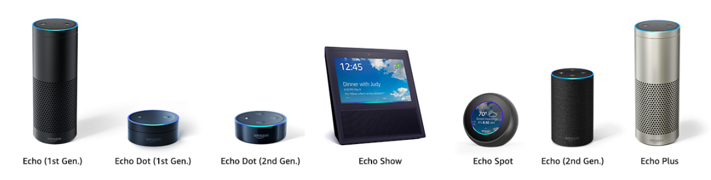

## Sharpen your Alexa skills

### Zdravko Danev

#### Sr. Developer @ AgileThought

#### E-mail: zdanev@gmail.com

#### Twitter: @zdanev

#### Code and Slides: http://github.com/zdanev/occ2018

---

## The state of AI, NLP, etc.

---

## Alexa and Echo

- Echo is a hardware device ("smart speaker") device

- Alexa is the voice personality behind the Echo devices

---

## User intereaction flow

---

## Before you begin

Register for a developer account(s)

- go to developer.amazon.com and register for a free developer account
- (optional) create aws.amazon.com account

---

### Alexa Voice Service (AVS)

- cloud based voice-recognition and NLP service that powers Amazom Alexa and Echo devices
- can be used to voice-enable virtually any device (i.e. Raspberi Pi) for building home automation or other voice-enabled solution

---

### Alexa Skills Kit (ASK)

- Alexa Skills SDK
- Documentation
- Samples

---

## Types of Alexa skills

### Custom skills

- Custom skills consume a web service that can be hosted anywhere and can be developed in any language.

### Smart Home skills

- Turn on/off the lights, set thermostat, control entertainment devices, etc.
- All interactions are handled by the Smart Home Skill API.

### Video skills

- All interactions are handled by the Video Skill API.

### Flash briefing skills

- Provide content such as news for the user’s flash briefing. 
- RSS or JSON feed.

---

## Create Alexa skill

1. Provide skill name
2. Select skill type
3. Add skill invocation name
- Two or more lower case words
- Cannot be a lunch phrase (launch, ask, tell, load, begin, enable)
- Cannot be a wake word (Alexa, Echo, Amazon, Computer)
- Does not need to be unique
4. Add custom intent
5. Add sample utterances

---

## Testing your Alexa skill

---

## Deploying Alexa skill

---

## Links

#### Amazone Developer Portal
[http://developer.amazon.com](http://developer.amazon.com)

#### Alexa Developer Portal
[http://developer.amazon.com/alexa](http://developer.amazon.com/alexa)

#### AWS SDK for .NET
[http://aws.amazon.com/sdk-for-net/](http://aws.amazon.com/sdk-for-net/)

#### Alexa Skills SDK for .NET (Tim Heuer)
[https://github.com/timheuer/alexa-skills-dotnet](https://github.com/timheuer/alexa-skills-dotnet)